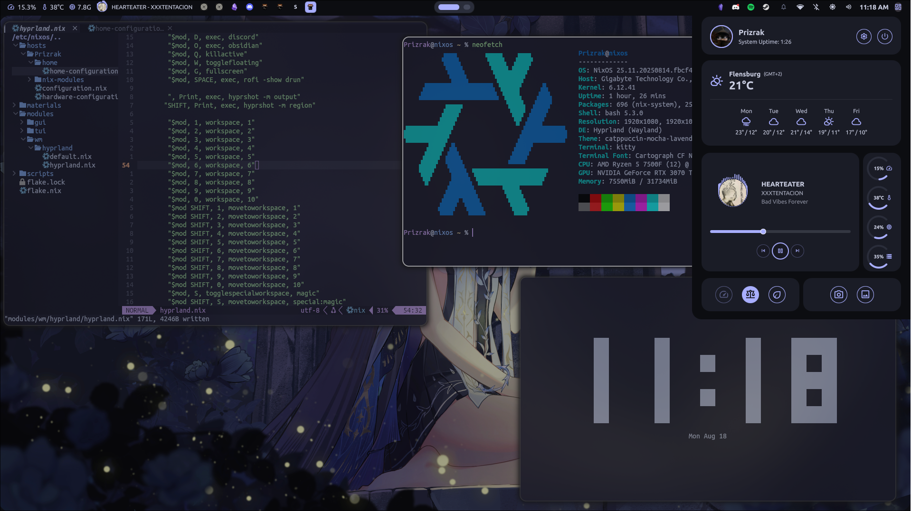
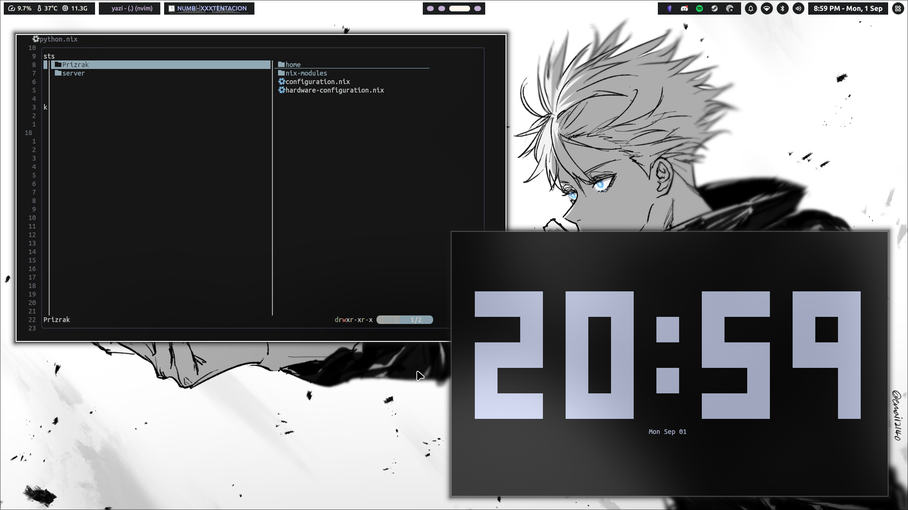
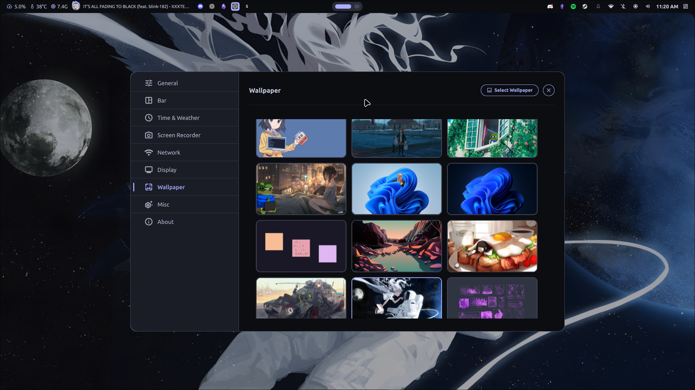

# Nixos
 
I created my own dotfiles on nixos :)

## Directory Structure

- **`lib/`** 🖥️  
  Files for neovim plugins.

- **`materials/`** 🎨  
  materials and wallpapers.

  - **`theme/`**: Custom theme.
  
- **`hosts/`** 🖥️  
  Host-specific configurations.

  - **`Prizrak/`**: My user configuration including `configuration.nix`, `hardware-configuration.nix`, `home/home-configuration.nix`, and `nix-modules/`.

- **`modules/`** ⚙️  
  Custom NixOS modules for desktop, editors, programs, and more.

  - **`gui/`**: Configuration for applications and related tools.
  - **`tui/`**: kitty, zsh and every tools in terminal configurations.
    - **`neovim/nvim`** 🖥️  
      Config for nvim. I taken from [Rhodium](https://github.com/pabloagn/rhodium).
  - **`wm/`**: Configurations for Hyprland.
  - **`gui/quickshell/`**: The current quickshell setup, [Noctalia](https://github.com/Ly-sec/Noctalia).

- **`scripts/`** 🔧  
  Scripts for my system.
  - **`nvim.sh`**: The scripts is for edit my config in my nvim.

- **`Wallpapers/`**: Collection of my wallpapers, [My Wallpapers](https://github.com/NazariiPalahnii/Wallpapers).
## Gallery 

