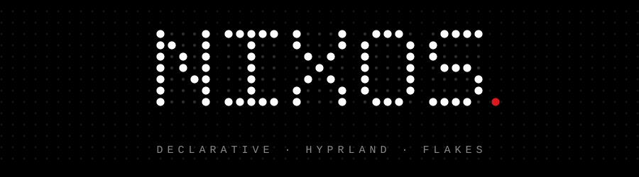
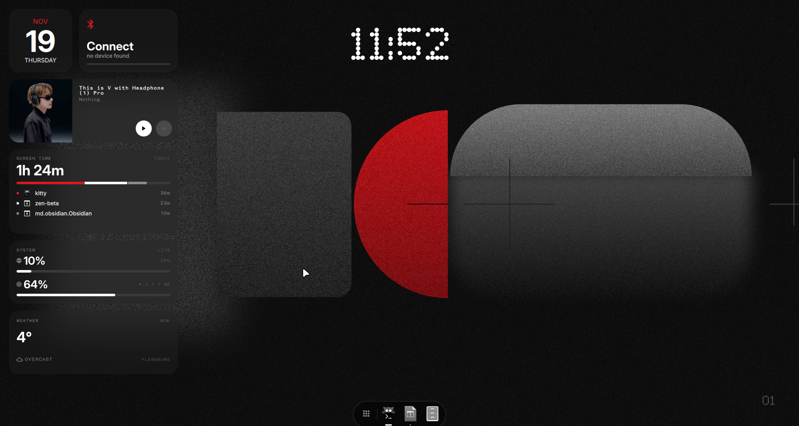

<div align="center">


</div>


### ABOUT

My personal NixOS setup, written as a flake.
The whole system (desktop, terminal, editor and tools) is described in code, so it can be rebuilt on any machine with one command.

| | |
|:--|:--|
| **OS** | NixOS (flakes) |
| **WM** | Hyprland 0.57 (Lua config) |
| **Shell / bar** | Quickshell with [nothing-panel](https://github.com/yurei07/nothing-panel) (Nothing OS style) |
| **Terminal** | kitty |
| **Shell** | zsh |
| **Editor** | Neovim |
| **Media** | mpv |


### GALLERY

<p align="center">
  
  
</p>


### STRUCTURE

```text
.
├── flake.nix            # entry point, inputs and nixosConfigurations
├── hosts/
│   ├── Prizrak/         # main machine: system config + home config
│   │   ├── modules/     # host-specific system modules (audio, gpu, laptop, ...)
│   │   └── home/        # Home Manager entry point
│   └── server/          # optional second machine
├── modules/
│   ├── wm/              # window manager (hyprland, polkit)
│   ├── gui/             # user-level graphical apps (nothing-shell, nautilus)
│   └── tui/             # terminal apps (kitty, zsh, neovim, fastfetch)
├── materials/           # per-application assets (mpv)
├── scripts/             # helper scripts (nvim.sh, update.sh)
├── themes/              # local theme stubs (chiaroscuro)
└── .github/             # CI + docs
```


### INSTALLATION

> Review the config before using it. Replace the hardware configuration with your own.

```bash
git clone https://github.com/yurei07/nixos.git
cd nixos

# generate hardware config for your machine
sudo nixos-generate-config --show-hardware-config > hosts/Prizrak/hardware-configuration.nix

# build and switch
sudo nixos-rebuild switch --flake .#nixos
```

### UPDATING

```bash
cd /etc/nixos
./scripts/update.sh
```


### CREDITS

- [Hyprland](https://hyprland.org)
- [nothing-panel](https://github.com/yurei07/nothing-panel)
- NixOS and Home Manager communities


